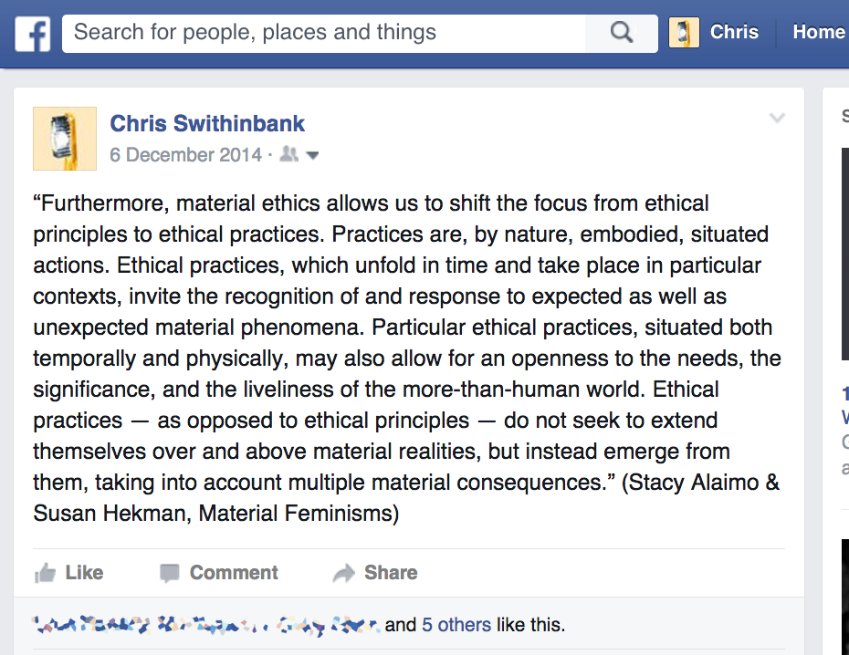
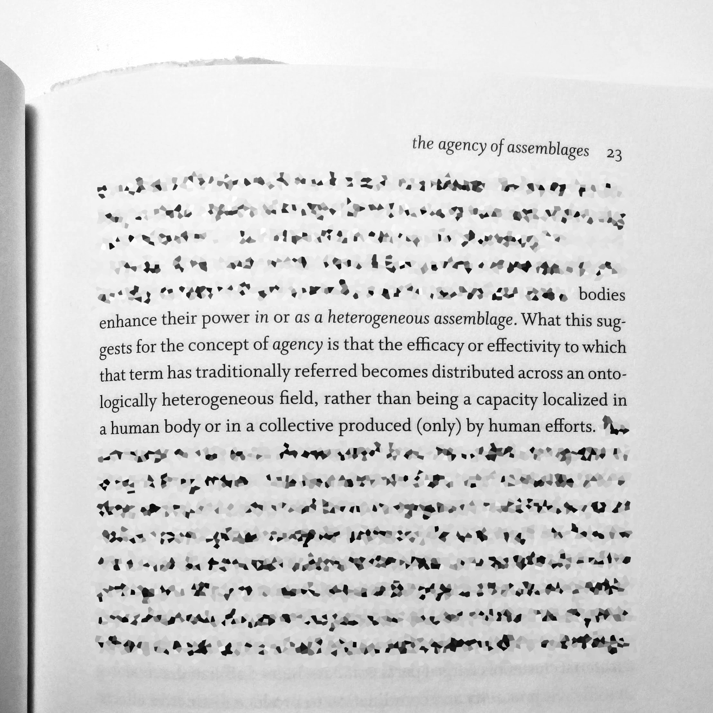

<!-- .slide: data-background="/img/title.gif" -->

[`j.mp/cs-ucsd`](http://bit.ly/cs-ucsd)
---
<!-- .slide: data-background="#000000" -->
<iframe width="853" height="480" src="https://www.youtube-nocookie.com/embed/C1Ksoprj-rk?rel=0&amp;showinfo=0" frameborder="0" allowfullscreen></iframe>

_union–seam_, JACK Quartet, 6 February 2016
---
<!-- .slide: data-background="/img/tomorrow-sketch.jpg" -->

_Tomorrow I will build a house here, if I can hold still_ Bettina Junge & Mathis Mayr (ensemble mosaik) 4 October 2014

Note:
<audio controls>
  <source src="../../snd/02-tomorrow-i-will-build-a-house-here.wav" type="audio/wav">
  Sorry, old browser, no audio for you.
</audio>
---
<!-- .slide: data-background="#000000" -->
---

Note:
Source: https://www.facebook.com/chris.swithinbank/posts/10101423363495555
---
> A practice is always a labour — a ‘work’ — on pre-existing materials and traces.

Stuart Hall, ‘Museums of Modern Art and the End of History’, 8
---
> Revolution is not a one-time event. It is becoming always vigilant for the smallest opportunity to make a genuine change in established, outgrown responses; for instance, it is learning to address each other’s difference with respect.

Audre Lorde, _Sister Outsider_, 140–41

---
<!-- .slide: data-background="#000000" -->

Note:
Difficulty of constant _tabula rasa_, but also perverse, and grounded in Platonic, unitary work concept.
---
<!-- .slide: data-background="/img/matter.gif" -->
> The Spinozist account of the body is of a productive and creative body which cannot be definitively “known” since it is not identical with itself across time. The body does not have a “truth” or a “true nature” since it is a process and its meaning and capacities will vary according to context. We do not know the limits of this body or the powers that it is capable of attaining. These limits and capacities can only be revealed in the ongoing interactions of the body and its environment.

Moira Gatens, _Imaginary Bodies: Ethics, Power, and Corporeality_, 57
---
<!-- .slide: data-background="/img/food-cubes.jpg" -->
---
<!-- .slide: data-background="/img/intensities.gif" -->
---
<!-- .slide: data-background="/img/matter.gif" -->
Jane Bennett, _Vibrant Matter_ (2010)

---
<!-- .slide: data-background="#000000" -->

Note:
- politics, ecology, environmentalism
- local relationships
- “necessity”
---
<!-- .slide: data-background="/img/union-haze-snap.jpg" -->

*union|haze*, ensemble recherche,  21 May 2016

Note:
<audio controls>
  <source src="../../snd/03-union-haze.wav" type="audio/wav">
  Sorry, old browser, no audio for you.
</audio>
---
Thanks! And good luck…
